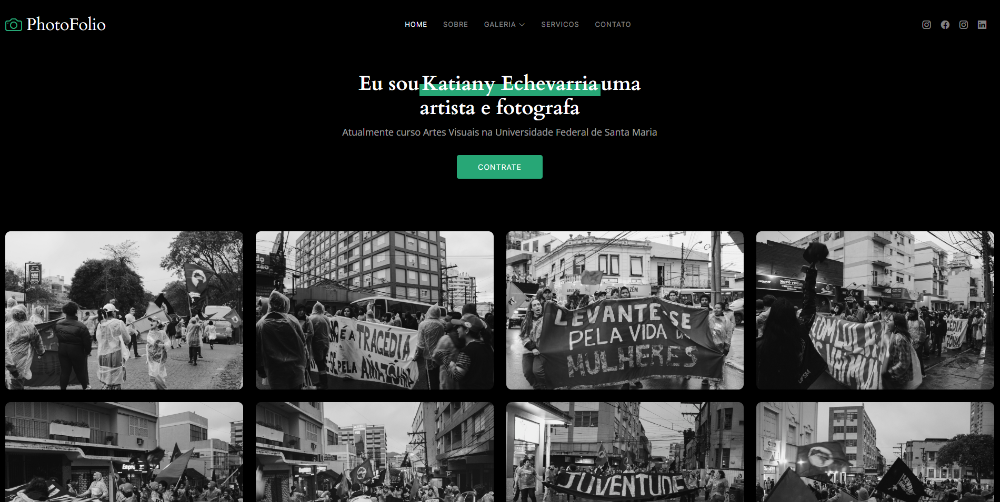

# Portifolio da fotografa, Katiany Echevarria

.

Acesso: Preencha aqui a URL para acesso ao site publicado

#### Desenvolvedor(a)
Luana Ferreira Oliveira

#### Cliente

#### Tecnologias

- HTML
- CSS
- Java Script

#### Ambiente de desenvolvimento

- VS Code
- GitHub

#### Créditos

Preencha aqui uma lista detalhada de recursos aproveitados no projeto, por exemplo:
- Fotos tiradas por Katiany Echevarria Pinto
- Pessoa nas fotos, Ismael Lisot
- Fotos de alimentos, Confeitaria Sabor de Felicidade
- Fotos de natureza, Parque Witeck
- https://bootstrapmade.com/photofolio-bootstrap-photography-website-template/

#### Bastidores

Meu cliente comecou com a ideia de um portifolio pessoal, porem nao parecia que teriamos projetos suficiente para tornar algo completo e interessante. Assim decidimos que cada um iria representar outra pessoa, no meu caso meu cliente esta representando a Katiany, estudante de Artes Visuais da UFSM.

Assim o proximo passo seria buscar um template que se encaixasse com o tipo de foto tirada pela artista. Como eu nao tinha experiencia com web foi confuso no comeco entender o codigo, e localizar onde deveria ser mudado e onde nao poderia mexer.
Com isso tive alguns problemas ao retirar itens que nao podia, que por exemplo tirava funcionalidades necessarias para o programa funcionar. Mas apos essa estranheza inicial o projeto fluiu e fiquei satisfeita com o resultado.

Contudo como nao tinha contato com desenvolvimento para web antes, senti que ao utilizar um template e soh alterar o codigo para ficar do jeito que gostaria acaba sendo confuso e nao muito aproveitador em relacao a aprender novos conteudos. Mas com o objetivo de se familializar com este tipo de programacao este projeto parece ter comprido este objetivo.

---
Projeto entregue para a disciplina de [Desenvolvimento de Software para a Web](http://github.com/andreainfufsm/elc1090-2023a) em 2023a
